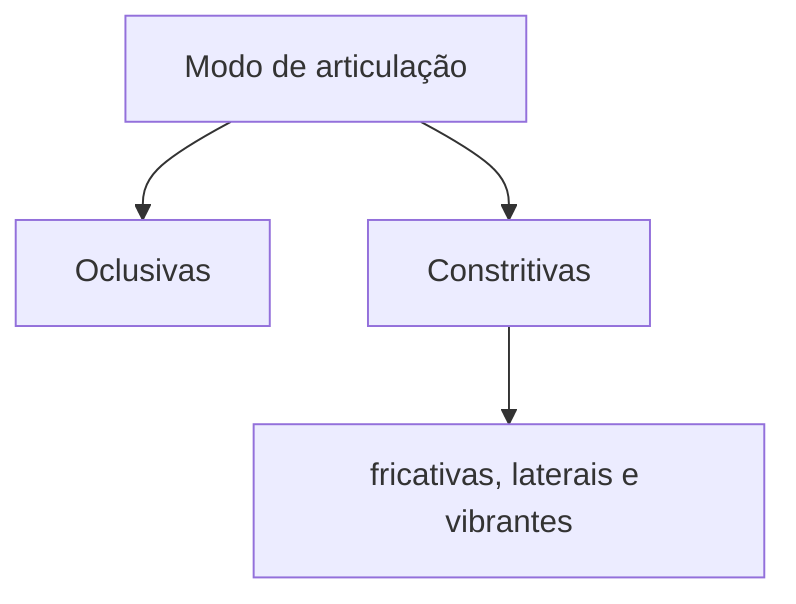
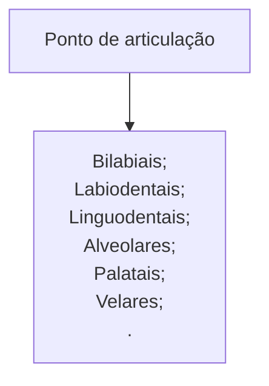
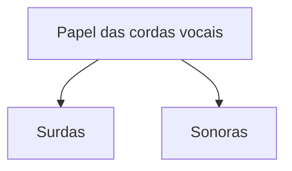

```mermaid
flowchart TD
    A[Modo de articulação] --> b[Oclusivas] & c[Constritivas]
    c --> c1[fricativas, laterais e vibrantes]
```
---

```mermaid
flowchart TD
    A[Ponto de articulação] -->  a[Bilabiais;
   Labiodentais;
   Linguodentais;
   Alveolares;
   Palatais;
   Velares;
   .]
```
---

```mermaid
flowchart TD
    A[Papel das cordas vocais] --> b[Surdas] & c[Sonoras]
```
---
```mermaid
flowchart TD
    A[Papel das cavidades bucal e nasal] --> b[Orais] & c[Nasais]
  ```
---
