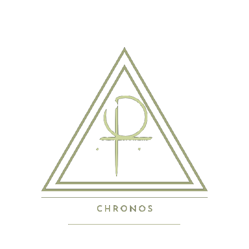

> [!cite] Chronos, um guia (quase) perfeito
>  
> # índice
> > [!example]+ Organização
> > > [!produzido]
> >  [Hebdomadário](/Se%C3%A7%C3%B5es%2FOrganiza%C3%A7%C3%A3o/Hebdomad%C3%A1rio.kanban.md): planejamento semanal em kanban.
> > [Gestão de disciplinas](https://www.noteshub.app/notebooks/github/Efzevios%2FChronos/Se%C3%A7%C3%B5es%2FOrganiza%C3%A7%C3%A3o/Gest%C3%A3o%20de%20disciplinas.kanban.md): planejamento dos estudos em kanban.
> >
> > > [!attention]Em produção
> > 
> >   
> > 
> >   
>  
> > [!example]+ Matérias
> > > [!info]+ O que é?
> > > Planejadores individuais dos atuais tópicos de estudo.
> > ---
> > - [Língua portuguesa](/Se%C3%A7%C3%B5es%2FDisciplinas%2FLinguagens%2FL%C3%ADngua%20Portuguesa/Kanban%20-%20L%C3%ADngua%20portuguesa.kanban.md)
> > - [Poesia](/Se%C3%A7%C3%B5es%2FDisciplinas%2FOutros%2FPoesia%2FNo%C3%A7%C3%B5es%20de%20versifica%C3%A7%C3%A3o%20(Cap.%2022%3B%20Nova%20gram%C3%A1tica%20do%20portugu%C3%AAs%20contempor%C3%A2neo)/Kanban%20-%20No%C3%A7%C3%B5es%20de%20versifica%C3%A7%C3%A3o.kanban.md)
