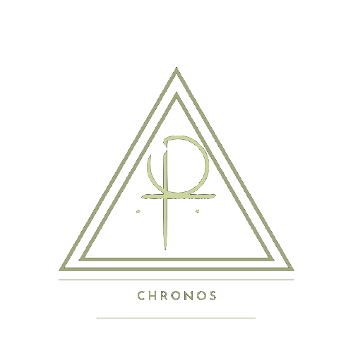

 
___
> [!cite] Chronos - índice
> > [!cite]- O que é?
> >  Aqui estão catalogados todos as seções do Chronos. Um modo rápido e eficiente de encontrar o quê precisa no momento que precisa.
> 
> > [!cite]+ Seções
> > > [!example]- Calendário  [Calendário](/Se%C3%A7%C3%B5es%2FCalend%C3%A1rio/Calend%C3%A1rio.md): seção destinada ao acompanhamento dos meses, como também registro de eventos e tarefas futuras.
> > 
> > > [!example]- Planejamento [Organização](/Se%C3%A7%C3%B5es%2FOrganiza%C3%A7%C3%A3o/Organiza%C3%A7%C3%A3o.md): seção de alocação da organização referente aos estudos e demais áreas da vida que necessitam de planejamento constante, quer seja mensual, quer seja hebdomadário.